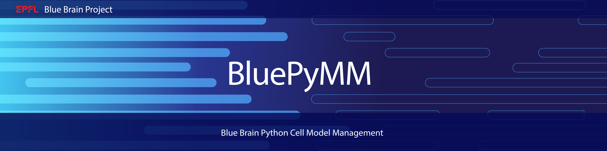

|banner|

BluePyMM
========

.. raw:: html

	<table>
	<tr>
	  <td>Latest Release</td>
	  <td>
	    
	  </td>
	</tr>
	<tr>
	  <td>Documentation</td>
	  <td>
	    
	  </td>
	</tr>
	<tr>
	  <td>License</td>
	  <td>
	    
	</td>
	</tr>
	<tr>
	  <td>Build Status</td>
	  <td>  
	    
	  </td>
	</tr>
	<tr>
	  <td>Coverage</td>
	  <td>
	    
	  </td>
	</tr>
	<tr>
		<td>Gitter</td>
		<td>
			<a href="https://gitter.im/bluebrain/bluepymm">
			
		</td>
	</tr>
	</table>

Introduction
------------

When building a network simulation, biophysically detailed electrical models (e-models) need to be tested for every morphology that is possibly used in the circuit.

E-models can e.g. be obtained using `BluePyOpt <https://github.com/BlueBrain/BluePyOpt>`_ by data-driven model parameter optimisation.
Developing e-models can take a lot of time and computing resources. Therefore, these models are not reoptimized for every morphology in the network.
Instead we want to test if an existing e-model matches that particular morphology 'well enough'.

This process is called Cell Model Management (MM). It takes as input a morphology release, a circuit recipe and a set of e-models with some extra information.
Next, it finds all possible (morphology, e-model)-combinations (me-combos) based on e-type, m-type, and layer as described by the circuit recipe, and calculates the scores for every combination.
Finally, it writes out the resulting accepted me-combos to a database, and produces a report with information on the number of matches.

Support
-------

We are providing support using a chat channel on `Gitter <https://gitter.im/BlueBrain/BluePyMM>`_.

Requirements
------------

* `Python 2.7+ <https://www.python.org/download/releases/2.7/>`_ or `Python 3.6+ <https://www.python.org/downloads/release/python-360/>`_
* `pip 9.0+ <https://pip.pypa.io>`_ (installed by default in newer versions of Python, make sure you upgrade pip to a version 9.0+)
* `Neuron 7.4 <http://neuron.yale.edu/>`_ (compiled with Python support)
* `eFEL eFeature Extraction Library <https://github.com/BlueBrain/eFEL>`_ (automatically installed by pip)
* `BluePyOpt <https://github.com/BlueBrain/BluePyOpt>`_ (automatically installed by pip)
* `NumPy <http://www.numpy.org>`_ (automatically installed by pip)
* `pandas <http://pandas.pydata.org/>`_ (automatically installed by pip)
* `matplotlib <https://matplotlib.org/>`_ (automatically installed by pip)
* `sh <https://pypi.python.org/pypi/sh>`_ (automatically installed by pip)

Installation
------------

.. code-block:: bash

    pip install bluepymm

NOTES: 

* Make sure you are using the latest version of pip (at least >9.0). Otherwise the ipython dependency will fail to install correctly.
* Make sure you are using a new version of git (at least >=1.8). Otherwise some exceptions might be raised by the versioneer module.

Quick Start
-----------

An IPython notebook with a simple test example can be found in:

https://github.com/BlueBrain/BluePyMM/blob/master/notebook/BluePyMM.ipynb

API documentation
-----------------
The API documentation can be found on `ReadTheDocs <http://bluepymm.readthedocs.io/en/latest/>`_.

License
-------

BluePyMM is licensed under the LGPL, unless noted otherwise, e.g., for external 
dependencies. See file LGPL.txt for the full license.

Funding
-------
This work has been partially funded by the European Union Seventh Framework Program (FP7/2007­2013) under grant agreement no. 604102 (HBP), the European Union’s Horizon 2020 Framework Programme for Research and Innovation under the Specific Grant Agreement No. 720270, 785907 (Human Brain Project SGA1/SGA2) and by the EBRAINS research infrastructure, funded from the European Union’s Horizon 2020 Framework Programme for Research and Innovation under the Specific Grant Agreement No. 945539 (Human Brain Project SGA3).

..
    The following image is also defined in the index.rst file, as the relative path is 
    different, depending from where it is sourced.
    The following location is used for the github README
    The index.rst location is used for the docs README; index.rst also defined an end-marker, 
    to skip content after the marker 'substitutions'.

.. substitutions

